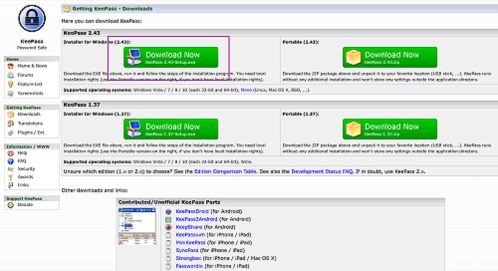
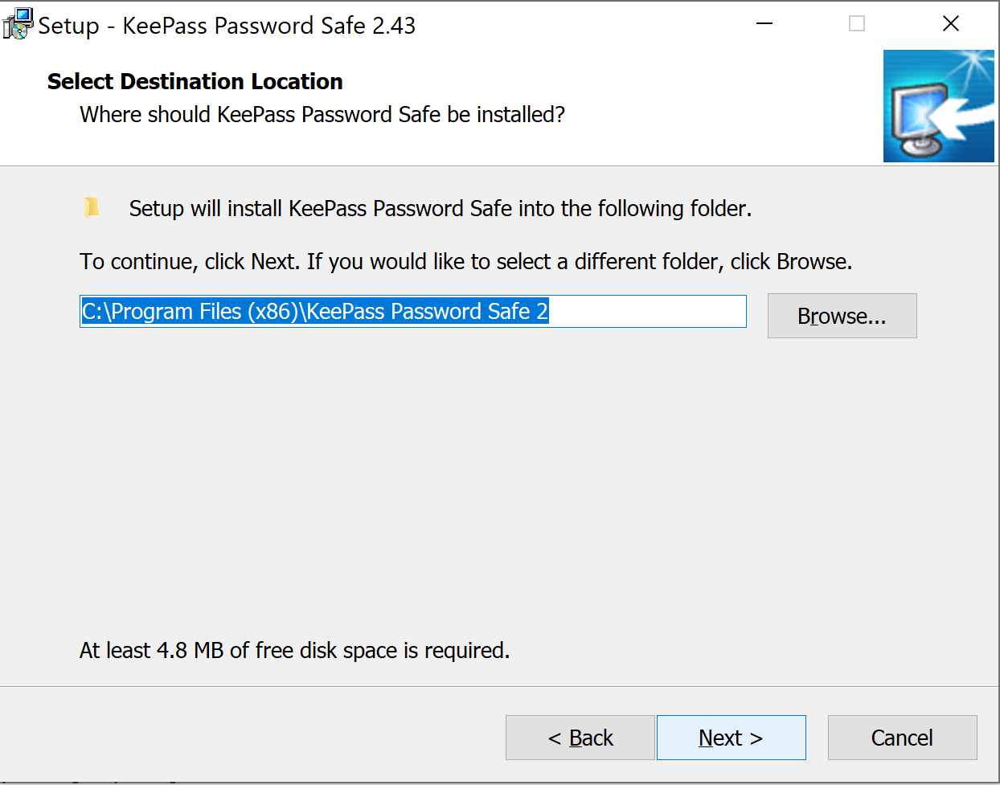

Title: Installing the KeePass Password Manager
Date: 2018-07-23 15:02
Modified: 2020-01-04 18:40
Author: Phil Grimes
Category: Blog
Tags: Security
Slug: installing-the-keepass-password-manager
Status: published

Today I want to walk through installing the KeePass password manager on Windows 10. This post will explore downloading, installing, and first steps to using a local password manager. The end result, for those who follow these steps, will be an encrypted password generation and storage mechanism.

#Setting Up KeePass

##Download KeePass

The first step in the process is downloading the installer. From the KeePass download page `<https://keepass.info/download.html>`_, there are options for both the installer and the portable package. While this post will be focused around installing the software on Windows 10, the portable option provides a good solution for users who need their passwords on multiple machines.

Choose the installer and then save the file to disk

Once downloaded, navigate in Explorer to wherever the file was saved. Usually, this is in C:\\Users\\$USER\\Downloads. Double clicking the installer will launch the process. After Windows User Access Control confirms permission to proceed, the KeePass installer will launch. The following series of images illustrates the install process.

##Installing KeePass

First, select the install language.

The license agreement is next. Be sure to read this before selecting "I accept the agreement", which is required in order to proceed.

I generally don't mess with the install path, but if you have a desire, the next dialogue allows for definition of where KeePass will be installed on the system.

Another area that I typically don't mess with, the component selection dialogue lets users take more control over what components of KeePass are installed.

Yet another menu that requires no changes, the options pictured below ensure that KeePass recognizes the .kdbx file extension, as well as letting the user decide if a desktop and/or Quick Launch shortcut should be created.

With all the options configured, take a moment to look over the install configuration before proceeding.

And we're off to the races! In a few moments KeePass will be installed on the local system.

Once installation completes, launching KeePass will take us into the next steps to configure a password database.

#Using KeePass

##Launch the Program

If you accepted the install defaults, there is an icon on the desktop. Otherwise find the launcher in the start menu and KeePass walks users through the basic steps of setting up a database.

Select the path and file name that will become the password database file.

The next step is to define the master password. This is the one password which users need to remember to access all the other passwords. Generally, I encourage users to use a ***`passphrase <https://en.wikipedia.org/wiki/Passphrase>`__*** rather than a password, for increased security.

Presuming both entries match, selecting "OK" will take us into some additional database settings. Again, since we're just covering the basics of KeePass, I won't be covering these today, but I encourage users to explore these other options.

The last step in the setup is to print the KeePass Emergency Sheet. Print this off, fill out the details, and keep it safe as this will contain the details to gain access, should someone need it.

And finally, we're presented with the KeePass interface. In a later post, we'll work with creating, editing, and using various entries, and how to put KeePass to work generating, and protecting, your passwords from prying eyes.

There are several default entries and categories within a default KeePass database. I highly recommend exploring the entries that are available, learning the options, and making some mistakes with passwords that don't matter before you start entering passwords on which you depend into KeePass.

#Conclusion

If you've followed along at home, we've successfully installed, configured, and started using the KeePass password manager. While this post was written to demonstrate the process on a Windows 10 machine, KeePass also runs on Linux and Mac. In the next post, I'll cover some notes on general usage of KeePass and the use of online alternatives. The goal here is to get readers to understand the benefits of using a password manager, and to illustrate the ease with which they can be implemented. I hope you've found this post to be informative and I appreciate the time you've taken to read it. Remember that we live in a hostile world and it is important to take measures to protect yourself!
